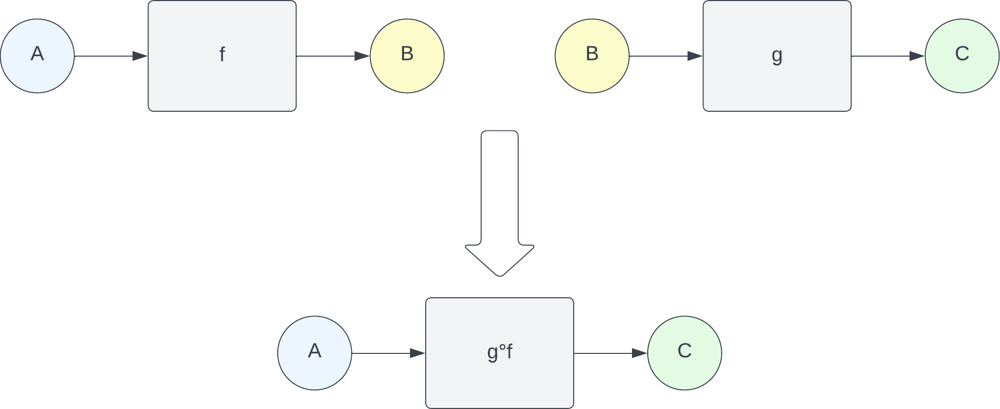
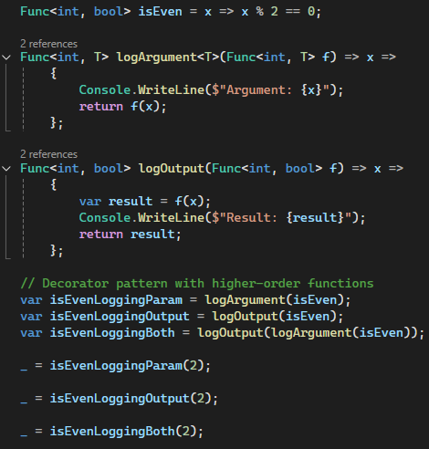
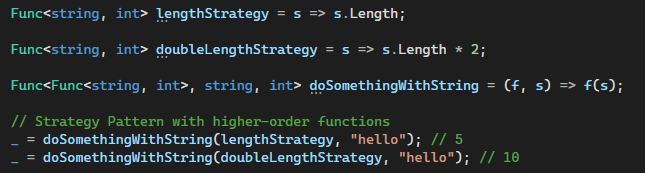
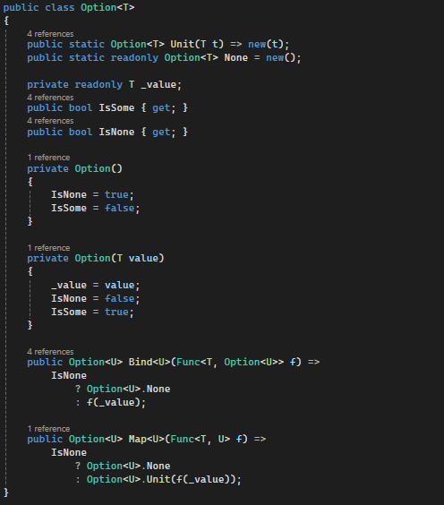

<!-- _color: white -->
<!-- _backgroundColor: #669 -->
<!-- backgroundColor: #ddffff -->

# Functional programming for C# developers: a gentle introduction (almost)
---

# Part I: Functions all the way down

---

## Introduction to Functional Programming

Functional programming (FP) is an approach to software development based, as the name suggests, on functions.

Functions (to be considered as mathematical functions) are called, in FP, __pure functions__.

Functions are first class citizens in FP.

---

## Mathematical Functions Definition

Mathematical functions have a precise definition:

* Given two sets _A_ and _B_
* Subsets of the cartesian product of two sets
* Elements of the first set appear only once

Mathematical functions in FP are called _pure functions_

---

### A simple example

Sample function: only the highlighted items couples are part of the function definition:

|  A / B |    b1    |      b2      |      b3      |      b4        |
|--------|----------|--------------|--------------|----------------|
| a1     | (a1, b1) | __(a1, b2)__ |   (a1, b3)   |   (a1, b4)     |
| a2     | (a2, b1) |   (a2, b2)   |   (a2, b3)   |   __(a2, b4)__ |
| a3     | (a3, b1) |   (a3, b2)   | __(a3, b3)__ |   (a3, b4)     |

---

## Pure Functions

In software development a pure function is therefore characterized by two fundamental aspects:

* __Determinism__: it always produces the same output when given the same input. This means that for any specific set of arguments, the function will consistently return the same result, without any variation
* __No side effects__: it does not cause any side effects, meaning it does not alter any external state or rely on data that can change outside of its scope. It does not depend on nor modify global variables, its behavior only depends on its inputs

Pure functions are then easier to reason about, test and debug: this enhances code readability and modularity, allowing developers to reuse them across different contexts with no unintended consequences

---

## Composition

Functions natively support composition

---

## FP/OOP comparison - principles of OOP

* To write software using an OOP approach you need to understand (and use):
    * encapsulation
    * polymorphism
    * inheritance
* to write __good__ OOP software sowftare you also need:
    * Design patterns (_decorator_, _factory_, _strategy_, _adapter_, ...)

---

## FP/OOP comparison - principles of FP

* To write software using a FP approach you need to understand (and use):
    * functions
* to write __good__ OOP software sowftare you also need:
    * functions

---

## Example 1: Decorator pattern

---

## Example 2: Strategy pattern

---
<!-- _color: white -->

# Part II: Venture into the _Monads_ hyperspace
_(fasten your seatbelts)_

---

## Monads

Intuitively, monads can be defined in terms of native types as follows:

* given a type `T`, a monadic type `MT` (or `M<T>`) behaves like a wrapper of the type `T`
* there should exist a `unit` function defining the wrapping logic, _`unit: T ──► MT`_
* it should expose a `bind` function to allow for chaining computation with another monad _`bind: (MT, T ──► MU) ──► MU`_

---

## Mathematical properties (Advanced)

_`unit`_ and _`bind`_ must satisfy three properties:

* __right identity__: _`unit(x).bind(func) == func(x)`_
* __left identity__: _`m.bind(unit) == m`_
* __associativity__: _`m.bind(f).bind(g) = m.bind(x => f(x).bind(g))`_

---

## Monads as Functors (Advanced)

Monads are also _Functors_, a more generic structure that still relies on the embedding _unit_ function and exposes a _map_ function:

* _`unit : T ──► MT`_
* _`map : (MT, T ──► U) ──► MU`_

The map function taks the wrapped value and maps it to another wrappable value to generate another functor.

---

## The Option Monad

The __Option__ monad (also called __Maybe__) is generally used to describe situations where data can be present or not: it can contain _Some_ data or _None_.

To implement it in _C#_ we need all the elements that characterize a monad:
- a _Unit_ function
- a _Map_ function
- a _Bind_ function

---

## The Option Monad: a simple C# implementation

---

# References

- [Functional Programming Design Patterns](https://fsharpforfunandprofit.com/fppatterns/)
- [tiny-fp](https://github.com/FrancoMelandri/tiny-fp)
- [Basic understanding of Monads, Monoids, and Functor](https://blog.knoldus.com/basic-understanding-of-monads-monoids-and-functor/)
- [Your easy guide to Monads, Applicatives, & Functors](https://medium.com/@lettier/your-easy-guide-to-monads-applicatives-functors-862048d61610)