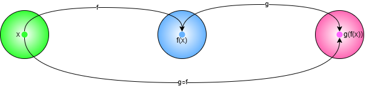

<!-- _footer: version ##{VERSION}## published ##{DATE}##-->
<!-- _color: white -->
<!-- _class: version -->
<!-- _backgroundColor: #669 -->
<!-- _paginate: skip -->

# Functional programming for C# developers: a gentle introduction (almost)


---

## Agenda

- **Part I: Functions all the way down**

  - What is Functional Programming?
  - Pure Functions & Mathematical Foundations
  - Function Composition
  - FP vs OOP Comparison

- **Part II: Advanced Concepts**

  - Functors
  - Monads
  - The Option Monad

- **Practical Applications for C# Developers**

---

## Why Functional Programming for C# Developers?

- **You already use it**: Linq, delegates, lambda expressions, pattern matching
- **Better code quality**: More predictable, testable, and maintainable code
- **Reduced bugs**: Immutability and pure functions eliminate entire classes of errors
- **Parallel processing**: FP naturally supports concurrent and parallel execution
- **Industry trends**: Growing adoption in enterprise applications and modern frameworks
- **Performance**: Often more efficient due to compiler optimizations and reduced side effects

---

## Part I: Functions all the way down

---

### Introduction to Functional Programming

Functional programming (FP) is an approach to software development based, as the name suggests, on functions.

Functions (to be considered as mathematical functions) are called, in FP, **pure functions**.

Functions are first class citizens in FP.

---

### Mathematical Functions Definition

Mathematical functions have a precise definition:

- Given two sets _A_ and _B_
- Subsets of the cartesian product of two sets
- Elements of the first set appear only once

---

#### A simple example

Consider a function that maps people to their favorite colors:

- a1 (Alice) → b2 (Blue)
- a2 (Bob) → b4 (Green)
- a3 (Carol) → b3 (Red)

| Person / Color | b1 (Yellow) | **b2 (Blue)**  | **b3 (Red)**   | **b4 (Green)** |
| -------------- | ----------- | -------------- | -------------- | -------------- |
| a1 (Alice)     | (a1, b1)    | **(a1, b2)** ✓ | (a1, b3)       | (a1, b4)       |
| a2 (Bob)       | (a2, b1)    | (a2, b2)       | (a2, b3)       | **(a2, b4)** ✓ |
| a3 (Carol)     | (a3, b1)    | (a3, b2)       | **(a3, b3)** ✓ | (a3, b4)       |

> **Key property**: Each person (input) maps to exactly one color (output)

---

### Pure Functions

Pure functions are easier to reason about, test and debug: this enhances code readability and modularity, allowing developers to reuse them across different contexts with no unintended consequences.
In software development a pure function is therefore characterized by two fundamental aspects:

- **Determinism**: it always produces the same output when given the same input. This means that for any specific set of arguments, the function will consistently return the same result, without any variation
- **No side effects**: it does not cause any side effects, meaning it does not alter any external state or rely on data that can change outside of its scope. It does not depend on nor modify global variables, its behavior only depends on its inputs

---

### Pure vs Impure Functions in C#

```csharp
// ❌ Impure: depends on external state, has side effects
private static int counter = 0;
public int GetNextId()
{
    counter++;           // Side effect: modifies external state
    return counter;      // Non-deterministic: different results
}

// ✅ Pure: deterministic, no side effects
public int Add(int a, int b)
{
    return a + b;        // Same inputs always produce same output
}

public string FormatName(string first, string last)
{
    return $"{last}, {first}";  // Pure transformation
}
```

---

### Composition

Consider two functions _f_ and _g_ where the output set of _f_ is (contained in) the input set of _g_:



We can then define their composition as `(g○f)(x) ≡ g(f(x))`

---

### FP/OOP comparison - principles of OOP

- To write software using an OOP approach you need to understand (and use):
  - encapsulation
  - polymorphism
  - inheritance
- to write **good** OOP software you also need:
  - Design patterns (_decorator_, _factory_, _strategy_, _adapter_, ...)

---

### FP/OOP comparison - principles of FP

- To write software using a FP approach you need to understand (and use):
  - functions
- to write **good** FP software you also need:
  - functions

---

### Example 1: Decorator pattern

```C#
bool isEven(int x) => x % 2 == 0;

int triple(int x) => x * 3;

// Decorate the usage of isEven with triple
bool isEvenTripleOf(int x) => isEven(triple(x));

Console.WriteLine($"Is triple of 2 even? {isEvenTripleOf(2)}"); // true

bool deny(bool b) => !b;

// Decorate the usage of isEven with deny
bool isOdd(int x) => deny(isEven(x));

Console.WriteLine($"Is 3 odd? {isOdd(3)}"); // true
```

---

### Example 2: Strategy pattern

```C#
int lengthStrategy(string s) => s.Length;

int doubleLengthStrategy(string s) => s.Length * 2;

int rankOfFirstCharStrategy(string s) =>
    "abcdefghijklmnnopqrstuvwxyz0123456789"
        .IndexOf(s.ToLowerInvariant()[0]);

static int doSomethingWithString(Func<string, int> f, string s) => f(s);

// Strategy Pattern with higher-order functions
var result1 = doSomethingWithString(lengthStrategy, "hello"); // 5
Console.WriteLine($"Length of hello is {result1}");

var result2 = doSomethingWithString(doubleLengthStrategy, "hello"); // 10
Console.WriteLine($"Double length of hello is {result2}");

var result3 = doSomethingWithString(rankOfFirstCharStrategy, "hello"); // 7
Console.WriteLine($"Rank of first char of hello is {result3}");
```

---

<!-- _color: white -->


## Part II: Venture into the _Monads_ hyperspace

...fasten your seat belts

---

### Functors

A **Functor** is any type that acts as a generic wrapper (or container), together with a function to transform the values it holds while preserving the container's structure.

This process is called _mapping_.

Does this sound complicated? Let's see a practical example.

A `List<T>` is a container for items of type `T`, and with the `Select` method it acquires a functorial structure:

```csharp
List<T2> Select<T1, T2>(List<T1> source, Func<T1, T2> selector)
```

This is exactly the Linq `Select` method you already know!

---

### Linq as Functional Programming

You're already doing functional programming with Linq!

```csharp
var numbers = new List<int> { 1, 2, 3, 4, 5 };

// Functional pipeline: pure functions, no mutation
var result = numbers
    .Where(x => x % 2 == 0)        // Filter
    .Select(x => x * x)            // Map/Transform
    .Sum();                        // Reduce

// Same as: var result = numbers.Where(IsEven).Select(Square).Sum();

// Pure helper functions
static bool IsEven(int x) => x % 2 == 0;
static int Square(int x) => x * x;
```

---

### Functor example

```csharp
static Output nullify(Input i) => null;
static Output combine(Input i) => new($"{i.FirstName} {i.LastName}");

var input = new Input("Fabio", "Lonegro");

var result = new Result<Input>(input).Map(combine);
Console.WriteLine($"is {nameof(result)} Successful? {result.IsSuccessful}"); // True

var result2 = new Result<Input>(input).Map(nullify);
Console.WriteLine($"is {nameof(result2)} Successful? {result2.IsSuccessful}"); // False

readonly struct Result<T>(T value) where T : class
{
    private T Value { get; } = value;
    public bool IsSuccessful { get; } = value is not null;
    public Result<U> Map<U>(Func<T, U> map) where U : class => new(map(Value));
}

sealed record Input(string FirstName, string LastName);

sealed record Output(string FullName);
```

---

### Monads

Intuitively, monads can be defined in terms of native types as follows:

- given a type `T`, a monadic type `MT` (or `M<T>`) behaves like a wrapper of the type `T`
- there should exist a `unit` function defining the wrapping logic, _`unit: T ──► MT`_
- it should expose a `bind` function to allow for chaining computation with another monad _`bind: (MT, T ──► MU) ──► MU`_

---

### Mathematical properties (Advanced)

_`unit`_ and _`bind`_ must satisfy three properties:

- **right identity**: _`unit(x).bind(func) == func(x)`_
- **left identity**: _`m.bind(unit) == m`_
- **associativity**: _`m.bind(f).bind(g) = m.bind(x => f(x).bind(g))`_

---

### Monads as Functors (Advanced)

Monads are also _Functors_, a more generic structure that still relies on the embedding _unit_ function and exposes a _map_ function:

- _`unit : T ──► MT`_
- _`map : (MT, T ──► U) ──► MU`_

The map function takes the wrapped value and maps it to another wrappable value to generate another functor.

---

### The Option Monad

The **Option** monad (also called **Maybe**) is generally used to describe situations where data can be present or not: it can contain _Some_ data or _None_.

To implement it in _C#_ we need all the elements that characterize a monad:

- a _Unit_ function
- a _Map_ function
- a _Bind_ function

---

### Option Monad: Practical Usage

```csharp
// Without Option: null checks everywhere
public string GetUserDisplayName(int userId)
{
    var user = GetUser(userId);
    if (user == null) return "Unknown";

    var profile = GetProfile(user.Id);
    if (profile == null) return user.Name;

    return profile.DisplayName ?? user.Name;
}

// With Option: chain operations safely
public string GetUserDisplayNameSafe(int userId)
{
    return GetUserOption(userId)
        .Bind(user => GetProfileOption(user.Id)
            .Map(profile => profile.DisplayName)
            .Or(() => Some(user.Name)))
        .ValueOr("Unknown");
}
```

---

### The Option Monad: a simple C# implementation


---

### References

- [Functional Programming Design Patterns](https://fsharpforfunandprofit.com/fppatterns/)
- [tiny-fp](https://github.com/FrancoMelandri/tiny-fp)
- [Basic understanding of Monads, Monoids, and Functor](https://blog.knoldus.com/basic-understanding-of-monads-monoids-and-functor/)
- [Your easy guide to Monads, Applicatives, & Functors](https://medium.com/@lettier/your-easy-guide-to-monads-applicatives-functors-862048d61610)
